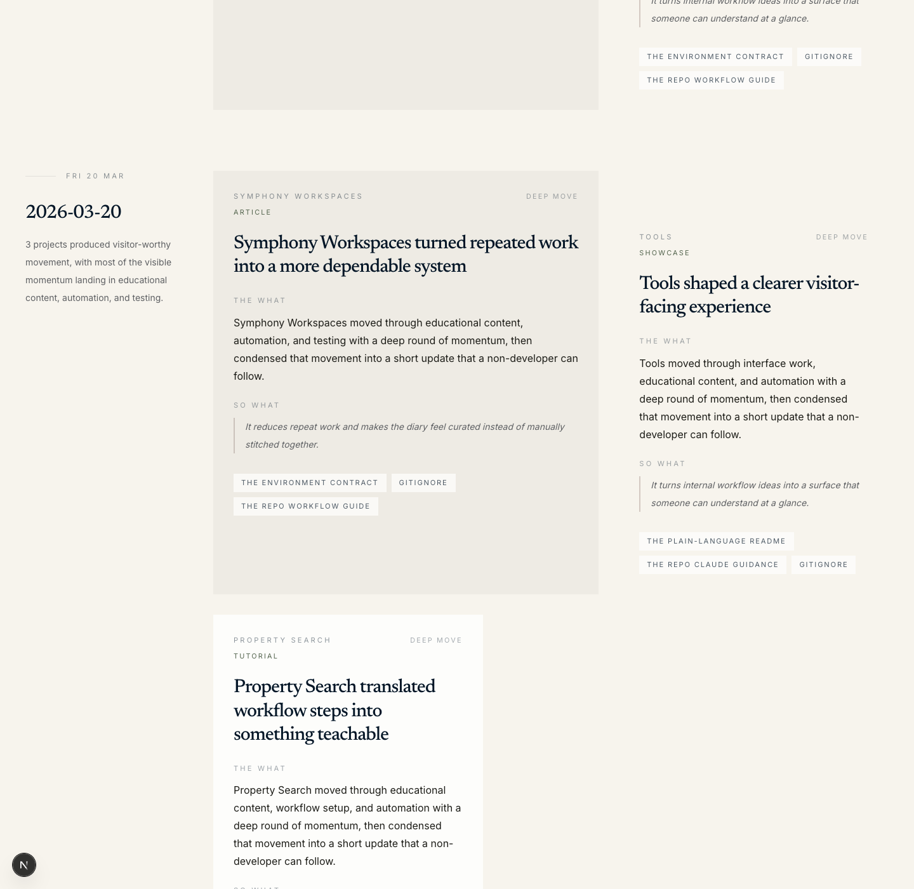

# Workflow Garden

Workflow Garden is a public educational site that explains an issue-driven AI development workflow in plain language. It is designed for curious non-developers and motivated newcomers who want to understand what the workflow is, which tools matter, how to set it up, and what meaningful daily coding activity looks like once it is translated into something human-readable.

Live URL: [workflow-garden.vercel.app](https://workflow-garden.vercel.app)

Current visual direction: the approved Stitch `B` archive treatment, adapted into repo-native React and Next components rather than copied export markup.

## Screenshots

### Landing overview


### Guided setup sheet


### Curated diary state



### Mobile overview


## What the MVP covers

- a plain-language explanation of the workflow
- an approachable tool map that explains when each major tool is useful
- a setup path that someone can follow without heavy jargon
- skim-friendly educational content and examples
- a curated daily diary generated from meaningful file activity under `/Users/rajeev/Code`

## Local commands

```bash
pnpm install
pnpm activity:refresh
pnpm dev
```

## Validation and proof

```bash
pnpm lint
pnpm test
pnpm build
pnpm proof
PROOF_BASE_URL=https://workflow-garden.vercel.app pnpm proof
```

Proof outputs live in:

- `output/acceptance/`
- `output/playwright/`

## Activity diary model

The deployed site cannot read `/Users/rajeev/Code` directly at runtime, so the repo generates a committed dataset before proof and deploy.

- `pnpm activity:refresh` scans `/Users/rajeev/Code`
- low-signal churn is ignored
- meaningful repo-day activity is translated into curated diary entries
- the app renders the generated JSON statically on Vercel

## Source of truth

- Product workflow: [AGENTS.md](./AGENTS.md)
- Approved visual spec: [.stitch/DESIGN.md](./.stitch/DESIGN.md)
- Current plan: [plans/workflow-garden-mvp.md](./plans/workflow-garden-mvp.md)
- Secrets contract: [docs/ops/secrets.md](./docs/ops/secrets.md)
- Vendor auth checks: [docs/ops/vendor-auth.md](./docs/ops/vendor-auth.md)
- Proof summaries: [output/acceptance/design-proof.md](./output/acceptance/design-proof.md), [output/acceptance/acceptance-proof.md](./output/acceptance/acceptance-proof.md)
